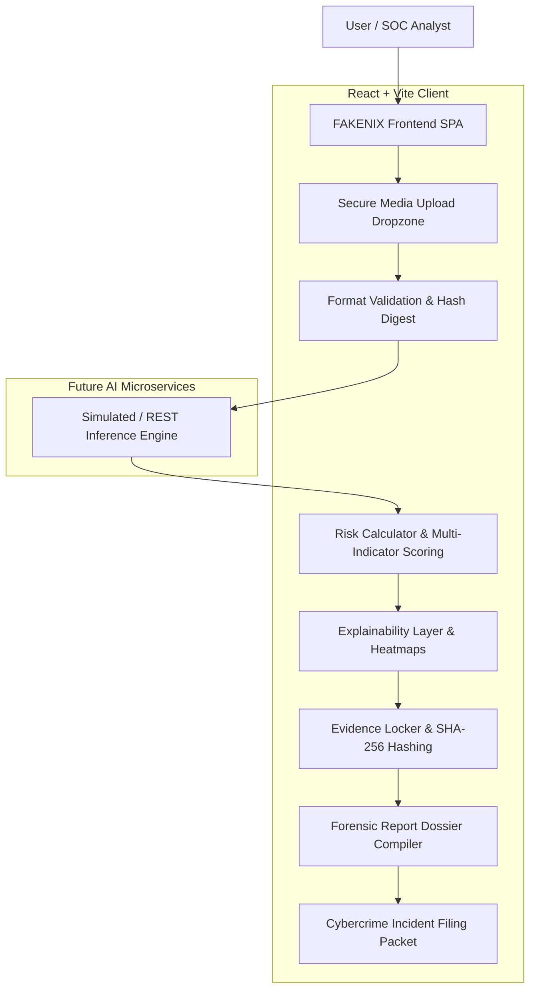

# FAKENIX 2.0

> **AI-Powered Deepfake Detection, Digital Forensics & Cybercrime Evidence Platform**  
> *"Detect. Verify. Investigate. Report."*

[](https://vitejs.dev/)
[](https://reactjs.org/)
[](LICENSE)
 

 

## About

**FAKENIX 2.0** is an enterprise-grade cybersecurity and digital forensics platform designed to empower individuals, law enforcement cells, journalists, and security operations centers (SOCs) to combat synthetic media threats. The platform provides an end-to-end investigative pipeline to inspect suspicious digital artifacts, assess manipulation probabilities, preserve tamper-evident cryptographic evidence, and format court-ready cybercrime incident dossiers.

> **Important Note on AI Engine & Demo Mode:**  
> This repository contains the complete, production-ready frontend interface with a rich client-side simulation engine (**DEMO MODE**). In Demo Mode, the platform emulates neural network outputs, realistic facial landmark detection, frame anomaly scores, and SHA-256 cryptographic hashing without requiring a dedicated GPU backend. When connected to the future Python/Flask AI microservice, real inference weights (e.g., EfficientNet, MesoInception) are seamlessly queried via REST endpoints.

---

## Problem Statement

The democratization of generative AI models (GANs, Latent Diffusion models, neural vocoders) has led to an exponential surge in high-fidelity synthetic media:
- **Identity Theft & Impersonation:** High-profile executives and private individuals are targeted with video clones and audio deepfakes.
- **Financial Fraud & CEO Scams:** Urgent voice clones authorizing fraudulent wire transfers cause millions in damages.
- **Disinformation & Election Interference:** Synthetic videos engineered to mislead public discourse and destabilize democratic institutions.
- **Digital Evidence Fragility:** Victims often lack the technical tools to capture cryptographic hashes, analyze EXIF metadata, or prove chain of custody before content is taken down or expunged.
- **Reporting Friction:** Traditional law enforcement portals require structured evidence packets that everyday users struggle to compile.

---

## Solution & Pipeline

FAKENIX 2.0 resolves these challenges by introducing a unified, forensic-first investigation lifecycle:

```
Media Upload
    ↓
Secure Ingestion & Validation
    ↓
EXIF & Header Metadata Extraction
    ↓
Preprocessing (Face Extraction & Frame Normalization)
    ↓
Neural AI Multi-Model Analysis
    ↓
Risk Assessment (Heuristic Weighting)
    ↓
Explainability & Anomaly Attribution
    ↓
Cryptographic Evidence Sealing (SHA-256 Chain of Custody)
    ↓
Forensic Dossier & Certificate Generation
    ↓
Official Cybercrime Incident Reporting (Sec 65B Admissible)
```

---

## Architecture



---

## Key Features

- 🛡️ **Multi-Format Ingestion:** Seamless drag-and-drop analysis for single images (JPEG, PNG, WEBP), videos (MP4, AVI, MOV), and remote URLs.
- 🔬 **AI Deepfake Detection:** Multi-model classification evaluating facial boundary artifacts, lighting mismatches, and noise residuals.
- ⏱️ **Frame-by-Frame Video Spectrum:** Interactive temporal probability curves, scrubbers, and filmstrips identifying peak manipulation frames.
- 📊 **Risk Scoring & Explainability:** Heuristic risk meters (Critical, High, Medium, Low) with human-readable indicator breakdowns.
- 🔐 **Cryptographic Evidence Locker:** Immediate SHA-256 and MD5 cryptographic fingerprinting with tamper-evident verification.
- 📜 **Chain of Custody Tracking:** Immutable audit logs tracking who uploaded, analyzed, and sealed the evidence artifact.
- 📑 **Court-Admissible Forensic Dossiers:** Exportable PDF-ready forensic reports and certificates of authenticity compliant with Section 65B electronic evidence standards.
- 🚨 **Cybercrime Incident Reporting:** Standardized reporting wizard compliant with national reporting portals (e.g., cybercrime.gov.in, IC3).
- 🎓 **Cyber Defense Academy:** Interactive educational center with synthetic anomaly spotting guides and a knowledge check quiz.
- ⚡ **SOC Command Center Dashboard:** High-level metrics, detection trends, recent activity streams, and quick actions.
- 🧪 **Full Offline Demo Mode:** Toggleable zero-dependency simulation mode with realistic mock detections and credentials.

---

## Technology Stack

### Frontend (Included in this repository)
- **Framework:** [React 18](https://react.dev/) + [Vite 5](https://vitejs.dev/)
- **Routing:** [React Router v6](https://reactrouter.com/)
- **Data Visualization:** [Recharts](https://recharts.org/)
- **Icons & UI:** [Lucide React](https://lucide.dev/)
- **HTTP Client:** [Axios](https://axios-http.com/)
- **Styling:** Modular Modern CSS with cybersecurity design tokens (Cyber Dark theme, glassmorphism, accent cyan/purple/red indicators)

### Future AI Backend Architecture *(To be integrated)*
- **Microservice:** Python 3.10+ / Flask / FastAPI
- **Deep Learning Frameworks:** PyTorch / TensorFlow / Keras
- **Models:** EfficientNet-B4, MesoInception-4, ResNet-50 GAN Residuals
- **Computer Vision:** OpenCV / MTCNN / Dlib (Facial landmarks & ROI alignment)
- **Database:** PostgreSQL / MySQL for persistent audit logs

---

## Project Structure

```
fakenix/
├── public/
│   └── favicon.svg              # Cyber shield vector favicon
├── src/
│   ├── components/
│   │   ├── common/              # Buttons, Badges, Modals, Loaders, Toasts
│   │   ├── dashboard/           # Stat cards, Detection charts, Activity tables
│   │   ├── detection/           # Upload dropzone, Previews, Risk scores
│   │   ├── forensic/            # Evidence cards, Metadata panels, Frame timeline
│   │   └── layout/              # Sidebar, Navbar, Breadcrumbs, ProtectedRoute
│   ├── data/                    # Rich mock detections, evidence, and report fixtures
│   ├── hooks/                   # useAuth, useDetection custom hooks
│   ├── pages/                   # All 20 application page views
│   │   ├── Landing.jsx          # Public product landing page
│   │   ├── Login.jsx            # Authentication portal with demo bypass
│   │   ├── Register.jsx         # New investigator onboarding
│   │   ├── Dashboard.jsx        # SOC command center
│   │   ├── Detect.jsx           # Detection method selector
│   │   ├── ImageAnalysis.jsx    # Image forensics workspace
│   │   ├── VideoAnalysis.jsx    # Video forensics workspace
│   │   ├── URLAnalysis.jsx      # Social/web link scanner
│   │   ├── Processing.jsx       # 4-stage neural pipeline animation
│   │   ├── Result.jsx           # Forensic verdict & confidence dossier
│   │   ├── FrameAnalysis.jsx    # Frame-by-frame anomaly scrubber
│   │   ├── History.jsx          # Forensic audit logs with CSV export
│   │   ├── Evidence.jsx         # Cryptographic evidence vault
│   │   ├── Reports.jsx          # Forensic dossiers & printable certificates
│   │   ├── CybercrimeReport.jsx # Law enforcement complaint generator
│   │   ├── Awareness.jsx        # Deepfake academy & interactive quiz
│   │   ├── Resources.jsx        # Helplines, legal frameworks & playbooks
│   │   ├── Settings.jsx         # AI model selection & API keys
│   │   ├── Notifications.jsx    # Alert stream for SOC analysts
│   │   └── NotFound.jsx         # Cyber-themed 404 handler
│   ├── services/                # API client, auth service, detection service
│   ├── utils/                   # Formatters, risk calculators, validators
│   ├── App.jsx                  # Application routing & context providers
│   ├── index.css                # Complete cybersecurity design system
│   └── main.jsx                 # Entry root
├── .env.example                 # Environment configuration template
├── .gitignore                   # Standard production gitignore
├── index.html                   # HTML5 template with Google fonts
├── package.json                 # Dependencies & scripts
└── vite.config.js               # Vite configuration
```

---

## Getting Started Locally

### Prerequisites
- [Node.js](https://nodejs.org/) (version 18.0 or later)
- `npm` or `yarn`

### Installation

1. **Clone the Repository:**
   ```bash
   git clone https://github.com/<your-username>/fakenix-2.0.git
   cd fakenix-2.0
   ```

2. **Install Dependencies:**
   ```bash
   npm install
   ```

3. **Configure Environment:**
   ```bash
   cp .env.example .env
   ```
   *(By default, `VITE_DEMO_MODE=true` is enabled, allowing complete offline execution without a backend.)*

4. **Start the Development Server:**
   ```bash
   npm run dev
   ```
   The application will be available at: `http://localhost:3000` (or the port specified in console).

5. **Build for Production:**
   ```bash
   npm run build
   ```

---

## Demo Credentials

You can test all protected workflows using either of the following methods:
- **Instant Demo Login:** Click the **"Fill Demo Credentials"** button on the `/login` page.
- **Manual Credentials:**
  - **Email:** `demo@fakenix.ai`
  - **Password:** `Demo@123`
- Any valid email format with at least 6 characters for the password is also accepted in demo mode.

---

## License

This project is licensed under the MIT License — see the [LICENSE](LICENSE) file for details.

---
